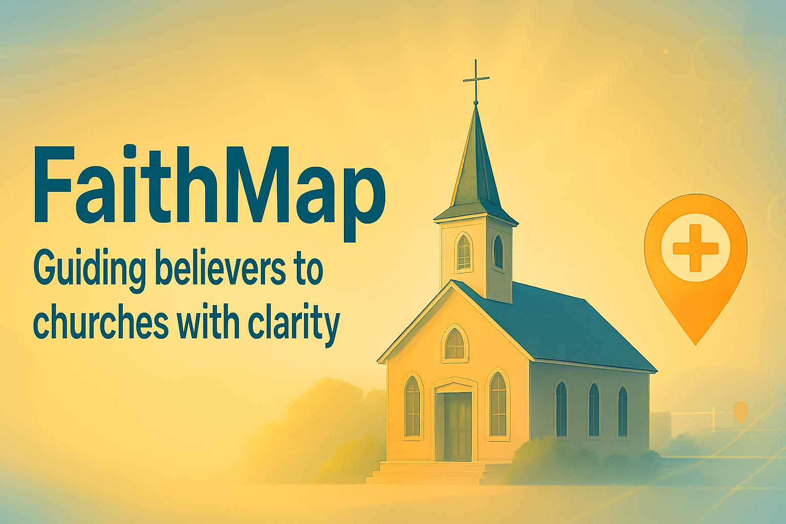
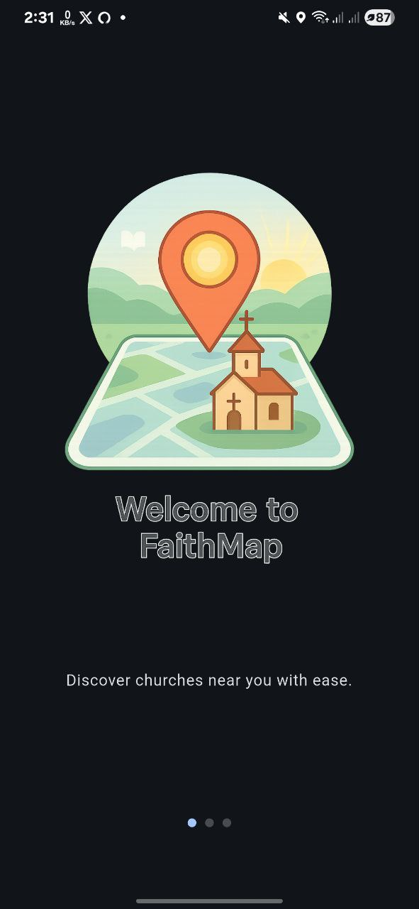
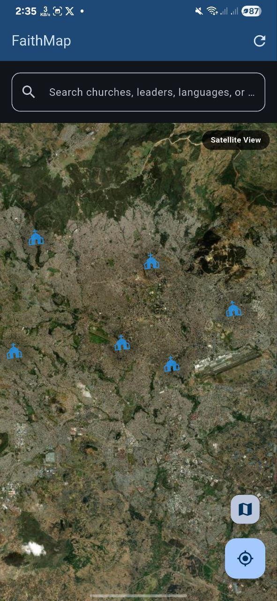

# FaithMap: Discover Your Spiritual Home in Ethiopia

  
*Your journey of faith starts here – A digital compass for the soul.*

---

## 🌟 Welcome to FaithMap: A Story of Connection and Discovery

Imagine wandering through the bustling streets of Addis Ababa, a newcomer seeking solace in a familiar place of worship. Or picture a devoted believer eager to explore new communities of faith across Ethiopia's diverse landscapes. This is where **FaithMap** comes in – not just an app, but a bridge between hearts and holy grounds.

FaithMap is a **Digital Church Directory and Navigation App** built with Flutter, designed to empower users to find, connect with, and navigate to Christian churches throughout Ethiopia. Born from a passion for community and spirituality, it's more than code; it's a tool for fostering unity in faith.

---

## 🚀 What Makes FaithMap Shine? Key Features

FaithMap transforms how you engage with your spiritual journey. Here's how it empowers you:

- **Service Schedules at Your Fingertips** 📅: View detailed times for regular worship, healing prayers, fasting services, and Bible studies – never miss a moment of inspiration.
- **Seamless Navigation & Distance Insights** 🗺️: Get precise directions, calculate distances, and even estimate travel times to your chosen church.
- **Amenities for Comfort** 🅿️: Check for parking availability and language services (like Amharic or English) to ensure a welcoming experience.
- **Support for Visitors & New Residents** 👋: Easily discover nearby churches, perfect for travelers, expats, or those relocating.
- **Boosting Church Visibility** 🔍: Helps churches reach more believers, strengthening community ties.
- **Building Believer Connections** 🤝: Facilitates meaningful interactions between individuals and faith communities.

Powered by intuitive maps, real-time location services, and a user-friendly interface, FaithMap is your faithful companion on mobile devices.

---

## 📖 The FaithMap Story: From Inspiration to Reality

Every great app has a origin story, and FaithMap's begins with a simple question: *How can technology nurture spiritual growth in a fast-changing world?*

As a developer passionate about Ethiopia's rich Christian heritage, I was motivated by personal experiences – the challenge of finding churches in new cities and the joy of connecting with like-minded believers. In a country where faith is woven into daily life, yet digital tools are emerging, FaithMap fills a vital gap. It's built on core values: **clarity** for easy use, **community** to unite users, and **spiritual purpose** to honor the divine.

The development journey was a labor of love, starting with sketches on paper and evolving through Flutter's cross-platform magic. I gathered real church data through grassroots efforts – collaborating with local pastors, friends, and community networks to verify locations, service times, and details. Each entry was cross-checked for accuracy, ensuring FaithMap is reliable and respectful.

Through iterations, challenges like geolocation precision were overcome, all while keeping the app lightweight and accessible. Today, on August 22, 2025, FaithMap stands as a testament to innovation driven by faith.

---

## 🖥️ Sneak Peek: FaithMap in Action

See how FaithMap brings faith to life on your screen:

  
*Slide into discovery: Our welcoming onboarding guides you to nearby churches with ease.*

  
*Explore and connect: Detailed listings with maps, services, and amenities at a glance.*

  
*Scan to Download: Get the APK from Google Drive and start your journey today!*

---

## 🙏 Heartfelt Acknowledgements

No story is complete without gratitude. FaithMap wouldn't exist without the support of incredible people and organizations:

- **Gara Innovation Hub** 🚀: For providing a nurturing space to innovate and grow.
- **Mr. Natnael Zerga** 🤝: Your generous support fueled this project from the start.
- **Mr. Denamo Markos** 📘: Thank you for your mentorship and unwavering encouragement.
- **Ms. Ruth Abiti** 🌟: Your guidance and belief in the vision were invaluable.
- **My Amazing Friends** 👥: For sharing real church data and helping verify every detail – you're the heart of this app.

Your contributions have turned a dream into a reality. Thank you! ❤️

---

*Made with  ❤️ by Yonatan B.*  
